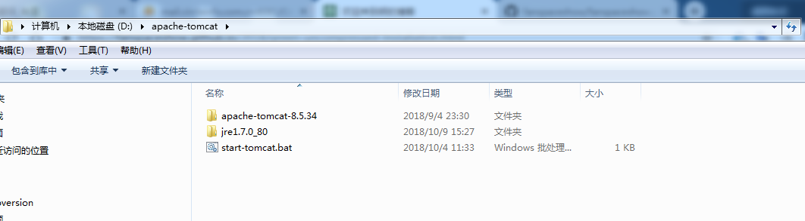

### Tomcat一键绿色解压安装版
``` bat
echo off
set "CURRENT_DIR=%cd%"
set "CATALINA_BASE=%CURRENT_DIR%\apache-tomcat-8.5.34"
set "CATALINA_HOME=%CURRENT_DIR%\apache-tomcat-8.5.34"
set JRE_HOME=%CURRENT_DIR%\jre1.7.0_80
set CLASSPATH=%JRE_HOME%\lib
set PATH=%PATH%;%JRE_HOME%\bin
call %CATALINA_HOME%\bin\startup.bat 
#pause
```
### 一键解压安装版目录结构
  