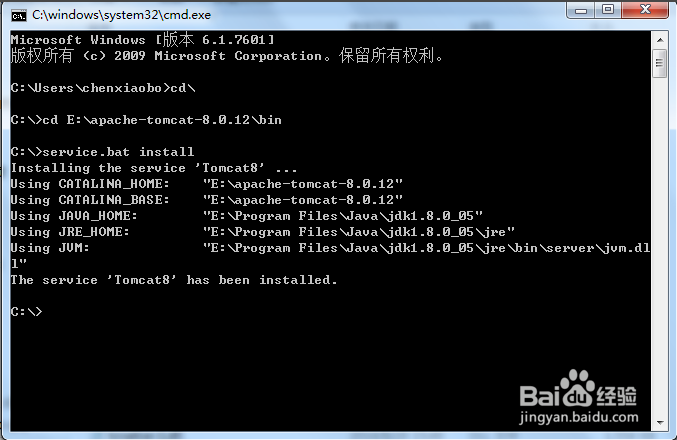
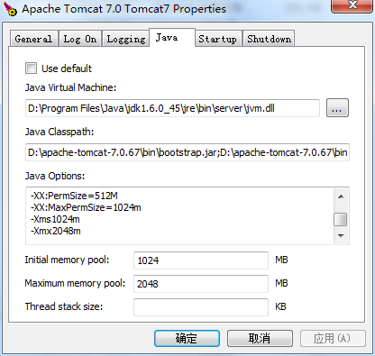
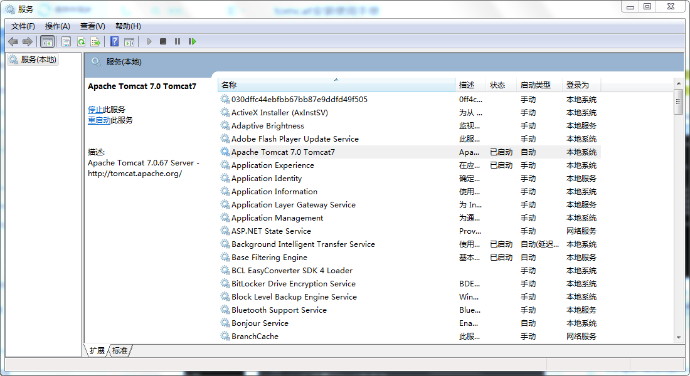
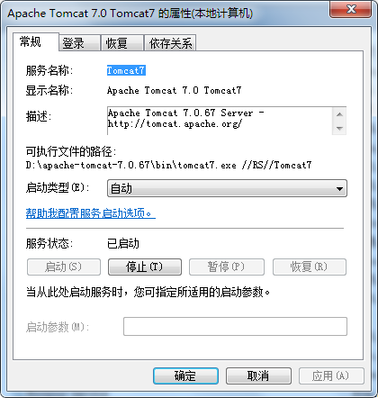

下载tomcat7，JDK6并安装tomcat7，JDK6
- 1 安装tomcat  
解压到D盘目录下
- 2 配置环境变量  
创建  
> CATALINA_BASE
```
D:\apache-tomcat-7.0.67
```
>CATALINA_HOME
```
D:\apache-tomcat-7.0.67 
```
>JAVA_HOME
```
D:\Program Files\Java\jdk1.6.0_45 
```
>CLASSPATH 
```
%JAVA_HOME%\lib\dt.jar;%JAVA_HOME%\lib\tools.jar;
%CATALINA_HOME%\lib\servlet-api.jar
```
>Path  
```
%JAVA_HOME%\bin;%JAVA_HOME%\jre\bin;
%CATALINA_HOME%\lib;%CATALINA_HOME%\bin
```
备注：  
==1，PATH使得系统可以在任何路径下识别java命令。  
2，CLASSPATH为java加载类(class or lib)路径，只有类在classpath中，java命令才能识别。==

- 2 执行 service.bat install 如下图：

- 3 修改 jvm或 PS Perm Gen内存


```
-XX:PermSize=512M  
-XX:MaxPermSize=1024m  
-Xms1024m  
-Xmx2048m
```
[XX:PermSize等参数介绍](http://note.youdao.com/noteshare?id=6ad1f57a1062f723585b98518deeba6f&sub=2F434985B04745559D3C8157BBD27B8A)  
如果 tomcat7.x 点击\bin\tomcat7.exe一闪而过

具体操作方法：打开命令行提示符窗口

=> 进入Tomcat安装目录==> 进入bin目录下==> 输入：service.bat remove tomcat服务名称（如tomcat6） ，再安装install一次。  
[参考网址](http://blog.csdn.net/orange_xxx/article/details/7299550)

内存问题：  
&nbsp;&nbsp;双击tomcat7.exe启动一闪而过，也有可能内存问题。可以通过jdk下的jconsole来监控内存问题。  
&nbsp;&nbsp;有一个方法可以检测，如果将内存恢复初始值，可以启动，增大内存就一闪而过，那说明你设置的内存过大，不符合你操作系统允许的最大限制。需要重新设定。（小提示，有时将-Xms,-Xmx去掉，只在Initial memory pool,Maximum memory pool中设定，就可以启动）

- 4 设置tomcat自启动
windows平台：进入控制面板\管理工具\服务  

双击打开服务，会看到“Apache Tomcat 7.0.67”，  
   

双击打开，会看到“启动类型”设置，设为“自动”即可。  
也可以在tomcat7w.exe中设置为"Automatic"，如下图：  

- 5 配置管理员角色
在apache-tomcat-7.0.67\conf目录下，有一份配置文件“tomcat-users.xml”。打开这份文件，里面会有这么一段代码
```XML
<role rolename="tomcat"/>
  <role rolename="role1"/>

  <user username="tomcat" password="tomcat"  roles="tomcat"/>
  <user username="both" password="tomcat"  roles="tomcat,role1"/>
  <user username="role1" password="tomcat"  roles="role1"/>
```
在其中加上
```XML
  <role rolename="admin-gui"/>
  <role rolename="manager-gui"/>
<user username="admin" password="123456" roles="manager-gui,admin-gui"/>
```
结果为
```XML
<tomcat-users>

  <role rolename="tomcat"/>
  <role rolename="role1"/>
  <role rolename="admin-gui"/>
  <role rolename="manager-gui"/>
<user username="admin" password="123456" roles="manager-gui,admin-gui"/>
  
  <user username="tomcat" password="tomcat" roles="tomcat"/>
  <user username="both" password="tomcat" roles="tomcat,role1"/>
  <user username="role1" password="tomcat" roles="role1"/>

</tomcat-users>
```

- 6 设置上传文件大小限制
    1. >D:\apache-tomcat-7.0.67\webapps\manager\WEB-INF\web.xml  
    
    在web.xml文件中，有如下代码
    ```XML
    <multipart-config>
      <!-- 50MB max -->
      <max-file-size>52428800</max-file-size>
      <max-request-size>52428800</max-request-size>
      <file-size-threshold>0</file-size-threshold>
    </multipart-config>
    ```
    默认最大50MB，修改后保存即可。然后重启tomcat。
    
      
