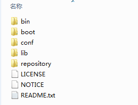

## 一.Maven本地环境搭建

1．下载Maven
在Maven官方网站，下载最新版本apache-maven-3.1.1-bin.zip，地址：[http://maven.apache.org/download.cgi](http://maven.apache.org/download.cgi)

2．解压安装
 解压apache-maven-3.1.1-bin.zip至D:\apache-maven-3.1.1目录，目录结构为如下



 3．配置MAVEN环境变量
【1】选择我的电脑->鼠标右键->属性->高级环境设置->环境变量-系统变量框下新增变量名M2_HOME，值为D:\apache-maven-3.1.1


【2】编辑变量名Path，在变量值中前面追加“%M2_HOME%\bin”


4．测试Maven安装成功
在命令行中输入： mvn –v 显示mvn版本信息为Apache Maven 3.1.1则为安装成功。

5．修改Maven默认配置(非常重要)
找到配置文件D:\apache-maven-3.1.1\conf\settings.xml。
【1】修改本地仓库位置

【2】配置阿里云镜像.

```xml
<mirrors>
       <mirror>
            <id>nexus-aliyun</id>
            <mirrorOf>*,!jeecg,!jeecg-snapshots</mirrorOf>
            <name>Nexus aliyun</name>
            <url>http://maven.aliyun.com/nexus/content/groups/public</url>
        </mirror>
 </mirrors>
```

【3】官方提供的Jeecg本地仓库下载 (非必须步骤)
     如果因为网络等问题导致依赖下载总失败，可以直接下载官方提供的本地仓库覆盖本地仓库。下载地址：  https://gitee.com/jeecg/jeecg-local-maven

- 提示：
> 因为国外镜像慢，所以采用国内阿里云镜像配置，需要排除jeecg私服配置，看参数mirrorOf。

OK，先来体会一下maven，在cmd中敲并回车执行：mvn help:system
这时候maven 就会从远程仓库开始下载一大堆的东西，没事，让它下载着，迟早都要下载的。

## 二. Eclipse安装Maven插件
1．Eclipse 插件安装
> 友情提示： 如果采用我们官方提供的eclipse，请确认下是否已经集成好maven，集成好的可以忽略这一步。

eclipse选择Help  -->  Install New Software输入地址
http://download.jboss.org/jbosstools/updates/m2eclipse-wtp/
把选项勾上，然后等待它下载安装，完成之后重启 eclipse 即可


2．Eclipse Maven配置
【1】Window->preferences找到maven下的Installations，添加maven的安装目录  


【2】 找到User Settings选择maven安装目录下的settings.xml，单击Update Settings

【3】修改maven默认选项，很重要
参考截图配置
选项说明： Offine : 选中标识不从仓库下载依赖，一般情况不选择。  


OK，eclipse配置已经完成了。
