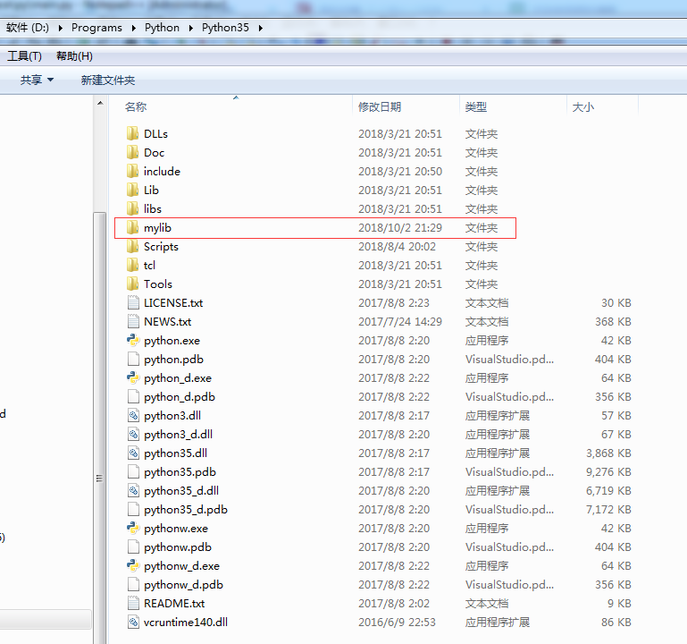
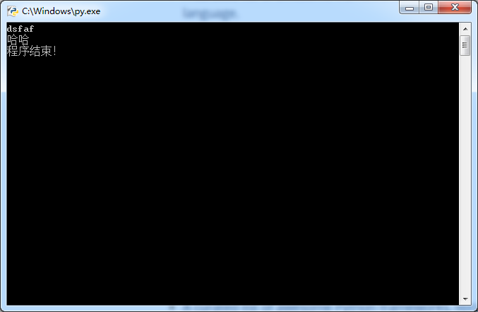

目录结构  

-- py  
&nbsp;&nbsp;&nbsp;&nbsp;&nbsp;&nbsp;&nbsp;--hello.py  
&nbsp;&nbsp;&nbsp;&nbsp;&nbsp;&nbsp;&nbsp;--main.py  

```python

#from uu.hello import *
import hello
print("dsfaf")

#helloWorld()
hello.helloWorld()

a = input("程序结束！")

```

```python
from hello import *
#import hello
print("dsfaf")

helloWorld()
#hello.helloWorld()

a = input("程序结束！")
```

-- py  
&nbsp;&nbsp;&nbsp;&nbsp;&nbsp;&nbsp;&nbsp;&nbsp;&nbsp;&nbsp;-- uu  
&nbsp;&nbsp;&nbsp;&nbsp;&nbsp;&nbsp;&nbsp;&nbsp;&nbsp;&nbsp;&nbsp;&nbsp;&nbsp;&nbsp;&nbsp;&nbsp;&nbsp;&nbsp;&nbsp;&nbsp;--__pycache__  
&nbsp;&nbsp;&nbsp;&nbsp;&nbsp;&nbsp;&nbsp;&nbsp;&nbsp;&nbsp;&nbsp;&nbsp;&nbsp;&nbsp;&nbsp;&nbsp;&nbsp;&nbsp;&nbsp;&nbsp;--\_\_init\_\_.py  
&nbsp;&nbsp;&nbsp;&nbsp;&nbsp;&nbsp;&nbsp;&nbsp;&nbsp;&nbsp;&nbsp;&nbsp;&nbsp;&nbsp;&nbsp;&nbsp;&nbsp;&nbsp;&nbsp;&nbsp;--hello.py

&nbsp;&nbsp;&nbsp;&nbsp;&nbsp;&nbsp;&nbsp;&nbsp;&nbsp;&nbsp;--\_\_init\_\_.py  
&nbsp;&nbsp;&nbsp;&nbsp;&nbsp;&nbsp;&nbsp;&nbsp;&nbsp;&nbsp;--main.py


```python

from uu.hello import *
#import uu.hello

print("dsfaf")

helloWorld()
# uu.hello.helloWorld()

a = input("程序结束！")
```

```python
#from uu.hello import *
import uu.hello

print("dsfaf")

#helloWorld()
uu.hello.helloWorld()

a = input("程序结束！")
```





```python

from mylib.hello import *
#import hello
print("dsfaf")

helloWorld()
#hello.helloWorld()

a = input("程序结束！")

```

```python

#from mylib.hello import *
import mylib.hello
print("dsfaf")

#helloWorld()
mylib.hello.helloWorld()

a = input("程序结束！")

```
