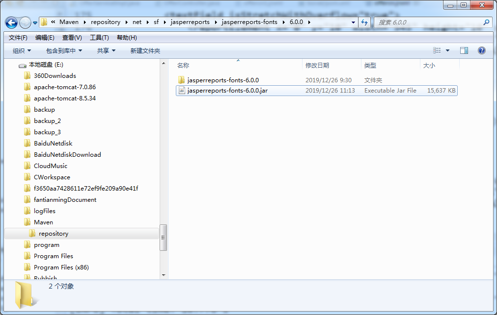
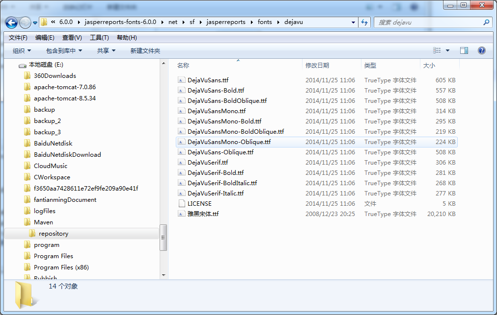

### JasperReport 6.x PDF中文显示问题解决办法详解

1. 先用解压工具将该jar包解压，得到该文件夹，如图




2. 进入到字体文件夹下，将中文字体放入到文件夹中，必须为ttf格式，自行改后缀的也不能用的。
jasperreports-fonts-6.0.0\net\sf\jasperreports\fonts\dejavu



3. 打开fonts.xml，添加如下配置


``` xml
	<fontFamily name="雅黑宋体">
		<normal>net/sf/jasperreports/fonts/dejavu/雅黑宋体.ttf</normal>
		<bold>net/sf/jasperreports/fonts/dejavu/雅黑宋体.ttf</bold>
		<italic>net/sf/jasperreports/fonts/dejavu/雅黑宋体.ttf</italic>
		<boldItalic>net/sf/jasperreports/fonts/dejavu/雅黑宋体.ttf</boldItalic>
		<pdfEncoding>Identity-H</pdfEncoding>
		<pdfEmbedded>true</pdfEmbedded>
		<exportFonts>
			<export key="net.sf.jasperreports.html">'雅黑宋体', Arial, Helvetica, sans-serif</export>
			<export key="net.sf.jasperreports.xhtml">'雅黑宋体', Arial, Helvetica, sans-serif</export>
		</exportFonts>

	</fontFamily>
```

4. 使用jdk工具重新打包

```cmd
E:\Maven\repository\net\sf\jasperreports\jasperreports-fonts\6.0.0>jar cvfm jasp
erreports-fonts-6.0.0.jar jasperreports-fonts-6.0.0\META-INF\MANIFEST.MF -C jasp
erreports-fonts-6.0.0/ .
```

```cmd
jar cvfm jasperreports-fonts-6.0.0.jar jasperreports-fonts-6.0.0\META-INF\MANIFEST.MF -C jasperreports-fonts-6.0.0/ .
```


- <a href="https://www.jianshu.com/p/8dba0bb2f5dd" type="text/html" target="_blank">JasperReport 6.x PDF中文显示问题解决办法详解</a> 